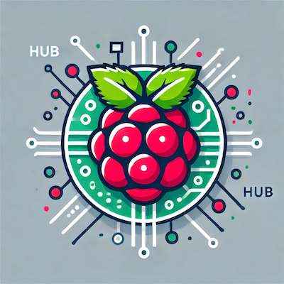

# HUB – Home Unified with Berry



A raspberry pi compose stack for home automation.

## Features

- Home Assistant - used for home automation
- SWAG (Nginx Proxy Manager) - used for exposing services to the internet
- Portainer - **Isolated** - used for managing docker containers
- Watchtower - used for auto-updating docker containers
- WG-Easy (Wireguard) - used for VPN access to the network
- Speedtest Tracker - used for tracking internet speed

## Notes

- This stack is targeted for a Raspberry Pi, but can be used in any other system and adapted easily if needed.
- This stack assumes that you have a domain and a dynamic DNS service to update your IP address.
- Some features are optional and can be removed if you don't need them.
  - Speedtest Tracker - if you don't want to track your internet speed
  - SWAG - if you don't want to expose services to the internet
  - WG-Easy - if you don't want to access your network remotely via VPN
  - Watchtower - if you don't want to auto-update your containers

## Installation

1. Fork the repository & clone it
2. Copy `portainer/docker-compose.yml` to your server

    ```bash
    scp portainer/docker-compose.yml user@server:/path/to/stack
    ```
   
3. Start the stack with

    ```bash
    docker-compose up -d
    ```
   
4. Login to Portainer and setup a stack pointing to `hub/docker-compose.yml`

5. Configure the following environment variables required for the stack & deploy it:

    ```
    STACK_TIMEZONE=Europe/Lisbon
    DUCK_DNS_EMAIL=abcd@example.com
    DUCK_DNS_URL=example-abcd.duckdns.org
    DUCK_DNS_TOKEN=1234abcd-1234-abcd-1234-abcd1234abcd
    WG_EASY_PASSWORD_HASH=$$2a$$12$$s.CX0aM5Rwx6n1XHZfJucO47.pNOmZ5QDIV5tbcRmmLmSojJEWJX2
    WG_EASY_ALLOWED_IPS=0.0.0.0/0, ::/0
    SPEEDTEST_TRACKER_APP_KEY=base64:YWJjZDEyMzQ=
    DOCKER_INTERNAL_SUBNET=123.0.0.0/24
    ```
